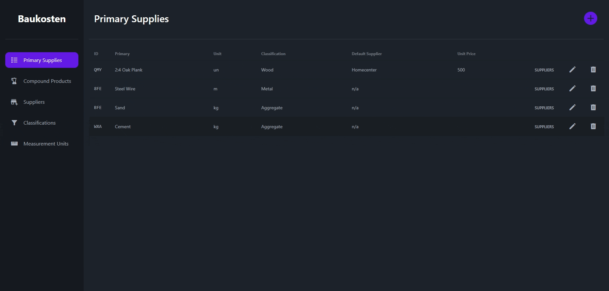

<h1 align="center" style="font-weight: 500">
<br>
Baukosten
<br>
</h1>
<h4 align="center">Your construction's materials budget planner</h4>
<br>
<div align="center">
  
  
  
  
</div>

<br>

<p align="center">
  <a href="features">Features</a> •
  <a href="#to-dos">To-Dos</a> •
  <a href="#how-to-use">How to use</a> •
  <a href="#Conclussions">Conclussions</a>
</p>



## Features

- [x] Generic CRUD Service
- [x] Generic Table
- [x] Lazy Loaded modules
- [x] CREATE, READ & DELETE operations
- [x] Detail View showing many-to-many relationships

## To-Dos

- [ ] UPDATE operation
- [ ] CREATE, UPDATE & DELETE operations for many-to-many tables
- [ ] GENERIC views for each operation, making it so modules for each entity aren't even required (but idk if this is possible haha)
- [ ] Implement more entities to create budgets for whole constructions
- [ ] Implement Auth and deploy it somewhere (?)

From these, only the first 2 are in the scope of the project.

## How to use

At the moment _Baukosten_ is a local-only web application, to use follow this guide:

```bash
# Clone this repo
$ git clone https://github.com/GabrielCornejoB/baukosten

# Install dependencies
$ cd baukosten/
$ npm install

# Run pocketbase backend
$ cd baukosten-api/
$ ./pocketbase.exe serve

# Run Angular app
$ cd ...
$ ng serve -o
```

Before starting the Angular app i suggest entering `http://127.0.0.1:8090/_/` in your browser, and check if the models are created, if not, there's a `pb_schema.json` in the same folder as the executable, with that file you can re-create the model.

## Conclussions

In other project, I usually create a **Main Challenges** section, but for this one I wanted to change it a little bit to something more positive. From this project I learned/improved in the following stuff:

- TypeScript Generics
- Tailwind
- Angular DOM Knowledge
- Practiced Data-modeling
- The **R** of REST (Representation)
- Define better the scopes for my projects
- Creating Generic components/services can be useful and minimize a lot of boilerplate code, but they come with the cost of less flexibility
